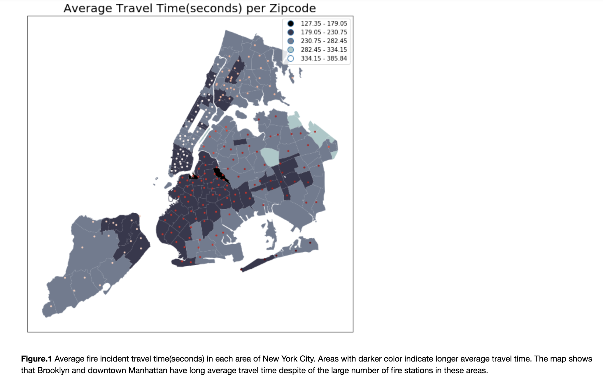

Reviewer: Adley Kim (ak3940)

Very interesting (and important!) topic.

Analysis:

In the future, it would be interesting to factor in other variables like traffic congestion, # of firetrucks per station, or the number of fires per zip code. But for the sake of this assignment, that's not really necessary.

One thing you may have wanted to look at is spatial autocorrelation (both global and local) using Moran's I and Geary's C. Based on your plot and your caption, it definitely seems like there is some spatial autocorrelation going on.

Overall, it's very clear what you're analysing in your plot. :)

Aesthetics:

It seems as though you color coded the fire stations by which borough they're in. Although I was able to figure it out, it wasn't immediately apparent. One solution could be to use the same color for every fire station and then use a thicker outline around the boroughs on the basemap.

In terms of color selection, it was a bit hard for someone like me (who has mild red-green colorblindness) to see the red dots on the map.

Other things that might help:

-Increasing the resolution to at least 300 dpi when you save the plot will make sure the image scales nicely.

-Matplotlib doesn't really have a lot great styling options for text, so if you really feel like going overboard, you can save the figure without any text and then add the title and description in manually in using a photo editor like Illustrator (PowerPoint actually works really well too).